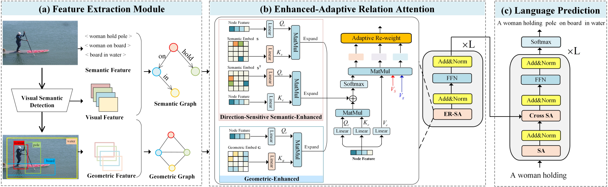

## Contents
1. [Introduction](#Introduction)
2. [Model Evaluation](#Model-Evaluation)
3. [Environment Requirements](#Environment-Requirements)
4. [Prepare Data](#Prepare-Data)
5. [Training](#Training )
6. [Ensemble Model](#Ensemble-Model)
7. [Acknowledgement](#Acknowledgement)


## Introduction
  
ER-SAN: Enhanced-Adaptive Relation Self-Attention Network for Image Captioning —— IJCAI22 **Oral**

In this paper, we propose to enhance the correlations between objects from a comprehensive view that jointly considers explicit semantic and geometric relations, generating plausible captions with accurate relationship predictions.



## Model Evaluation

> ** Here are pretrained model. You can download these file for evaluation.
- checkpoint for ER-SAN on image caption using cross-entropy: [log_transformer_triplet](https://drive.google.com/drive/folders/1y9QhVB10LSehCjPnEmD-fFKTatZFIQKI?usp=share_link).
- checkpoint for ER-SAN on image caption using CIDEr optimization: [log_transformer_triplet_rl](https://drive.google.com/drive/folders/1y9QhVB10LSehCjPnEmD-fFKTatZFIQKI?usp=share_link). 

For evaluation:

```bash
CUDA_VISIBLE_DEVICES=0 python eval.py --dump_images 0 --num_images 5000 --model log_transformer_triplet_rl/model-best.pth --infos_path log_transformer_triplet_rl/infos_transformer_triplet_rl-best.pkl --language_eval 1 --beam_size 1
```
You can get similar results on the MSCOCO Karpathy split.
```
   Model         |      Cross Entropy             |        RL 
                 | B@1  B@4  M    R    C     S    | B@1   B@4   M   R    C     S
Transformer(Base)| 75.8 34.2 27.7 56.1 113.4 20.8 | 80.6 38.4 28.6 58.4 128.6 22.6
ER-SAN[Ours]     | 78.2 38.8 29.2 58.5 122.9 22.2 | 82.1 41.7 30.1 60.3 135.3 23.8
```


## Environment Requirements

* First, clone the repository locally:
```shell
git clone https://github.com/CrossmodalGroup/ER-SAN.git
cd ER-SAN
```
* Then, create an environment and install PyTorch and torchvision:
```shell
conda create -n ER-SAN python=3.6
conda activate ER-SAN
pip install -r requirements.txt
# ^ if the CUDA version is not compatible with your system; visit pytorch.org for compatible matches.
```
* For cider and coco-caption evaluation for python3, download [cider](https://drive.google.com/drive/folders/1jY3NcPrDRoJcv1glI5mferDKPXpfZAkJ?usp=share_link) and [coco-caption](https://drive.google.com/drive/folders/1xgDFT3_uqTMmTjtSUb5ZUOT6TXSQ6AU5?usp=share_link)
or refer to [ruotian](https://github.com/ruotianluo/self-critical.pytorch])


## Prepare Data
Check [DATASET.md](data/DATASET.md)  for instructions of data downloading.

## Training
### Cross Entropy Training
Run the script train_triplet.sh or use the following code to train the model: 
```bash
CUDA_VISIBLE_DEVICES=0 python train.py --id transformer_triplet --caption_model transformer_triplet --checkpoint_path log_transformer_triplet --label_smoothing 0.0 --batch_size 10 --learning_rate 3e-4 --num_layers 4 --input_encoding_size 512 --rnn_size 2048 --learning_rate_decay_start 3 --learning_rate_decay_rate 0.5 --scheduled_sampling_start 0 --save_checkpoint_every 3000 --language_eval 1 --val_images_use 5000 --max_epochs 18 --noamopt_warmup 33000 --use_box 1 --loader_num_workers 4 --sg_label_embed_size 512 --seq_per_img 5 --use_warmup
```
The train script will dump checkpoints into the folder specified by `--checkpoint_path`. We only save the best-performing checkpoint on validation and the latest checkpoint to save disk space.

To resume training, you can specify `--start_from` option to be the path saving `infos.pkl` and `model.pth` (usually you could just set `--start_from` and `--checkpoint_path` to be the same).

If you have tensorflow, the loss histories are automatically dumped into `--checkpoint_path`, and can be visualized using tensorboard.

For more options, see `opts.py`.

You can run test_triplet.sh or following code for evaluation:
```bash
CUDA_VISIBLE_DEVICES=0 python eval.py --dump_images 0 --num_images 5000 --model log_transformer_triplet/model-best.pth --infos_path log_transformer_triplet/infos_transformer_triplet-best.pkl --input_json data/cocotalk_final.json --language_eval 1 --beam_size 1 --sg_label_embed_size 512
```

### Self-critical RL training
First, copy the model from the pretrained model using cross entropy. 
```bash
$ bash scripts/copy_model.sh transformer_triplet transformer_triplet_rl
```

Then run train_triplet_rl.sh or following code:

```bash
CUDA_VISIBLE_DEVICES=0 python train.py --id transformer_triplet_rl --caption_model transformer_triplet --checkpoint_path log_transformer_triplet_rl --label_smoothing 0.0 --batch_size 10 --learning_rate 4e-5 --num_layers 4 --input_encoding_size 512 --rnn_size 2048 --learning_rate_decay_start 17  --learning_rate_decay_rate 0.8  --scheduled_sampling_start 0 --save_checkpoint_every 3000 --language_eval 1 --val_images_use 5000 --self_critical_after 17 --max_epochs 58 --loader_num_workers 4 --start_from log_transformer_triplet_rl  --sg_label_embed_size 512 --seq_per_img 5 --use_box 1
```


### Ensemble model
Our code allows different models trained from different random seeds to be combined to form an ensemble model.
The eval_ensemble.py assumes the model saving under log_transformer_triplet_$seed. Run following code in test_triplet_ensemble.sh:
```bash
CUDA_VISIBLE_DEVICES=0 python eval_ensemble.py --dump_images 0 --num_images 5000 --input_json data/cocotalk_final.json --language_eval 1 --beam_size 1 --sg_label_embed_size 512 --ids transformer_triplet_2022 transformer_triplet_42 transformer_triplet_5201314 transformer_triplet_901 --id ensemble_model --verbose_loss 1
```
## Acknowledgement
Our code is mainly modified from [yahoo/object_relation_transformer](https://github.com/yahoo/object_relation_transformer). We use the visual features provided by Bottom-Up [peteanderson80/bottom-up-attention](https://github.com/peteanderson80/bottom-up-attention), and the semantic graph data provided by [WeakVRD-Captioning](https://github.com/Gitsamshi/WeakVRD-Captioning), the geometry graph data provided by [VSUA-Captioning](https://github.com/ltguo19/VSUA-Captioning). If you think this code is helpful, please consider to cite the corresponding papers and our IJCAI paper.

```bash
@inproceedings{ijcai2022p151,
  title     = {ER-SAN: Enhanced-Adaptive Relation Self-Attention Network for Image Captioning},
  author    = {Li, Jingyu and Mao, Zhendong and Fang, Shancheng and Li, Hao},
  booktitle = {Proceedings of the Thirty-First International Joint Conference on
               Artificial Intelligence, {IJCAI-22}},
  publisher = {International Joint Conferences on Artificial Intelligence Organization},
  editor    = {Lud De Raedt},
  pages     = {1081--1087},
  year      = {2022},
  month     = {7},
  note      = {Main Track},
  doi       = {10.24963/ijcai.2022/151},
  url       = {https://doi.org/10.24963/ijcai.2022/151},
}
```

